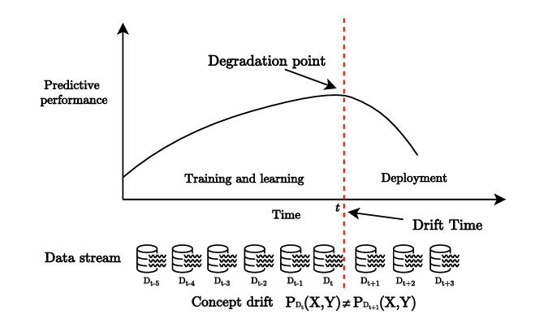

# From Concept Drift to Model Degradation
## An Overview on Performance-Aware Drift Detectors
Based on the review by Bayram et al., 2022  
Eirini Tzanaki, 2025

---

# What is this paper about?

- Review paper
- Focus: model performance degradation as drift signal
- Surveys methods from 2011-2021
- Highlights gaps for future research

---

# Key Concepts

- **Concept Drift** = change in $P_t(X, y)$
- Types: real, virtual, prior, recurring, sudden, gradual, incremental
- Variables: $X$ = input, $y$ = output

---

# Performance-based Drift Detection

<figure>
  
  <figcaption>Figure: Performance-based concept drift mechanism</figcaption>
</figure>

---

# Main Detection Strategies

### Statistical Process Control (SPC)
- Example: DDM
- Monitor error with thresholds

### Windowing Techniques
- Example: ADWIN
- Compare recent vs past performance

### Ensemble Methods
- Example: DWM
- Detect disagreement between ensemble members (learners)

---

# Tools & Metrics
- **Tools**: Hoeffding bound, Fisher/Wilcoxon test, CUSUM
- **Metrics**: Accuracy, AUC, Entropy, Confusion Matrix
- **Learners**: Hoeffding Tree, Naive Bayes, ELM

---

# Why this paper matters
- Clarifies terminology in the field
- Categorizes 40+ methods
- Helps design robust ML systems in real-world settings

---

# Summary of Findings
- Tests methods on simulated/real-world datasets
- Most evaluated on sudden/gradual drift
- Results vary by drift type & classifier
- Emphasizes need for consistent evaluation

---

# Thank you!

